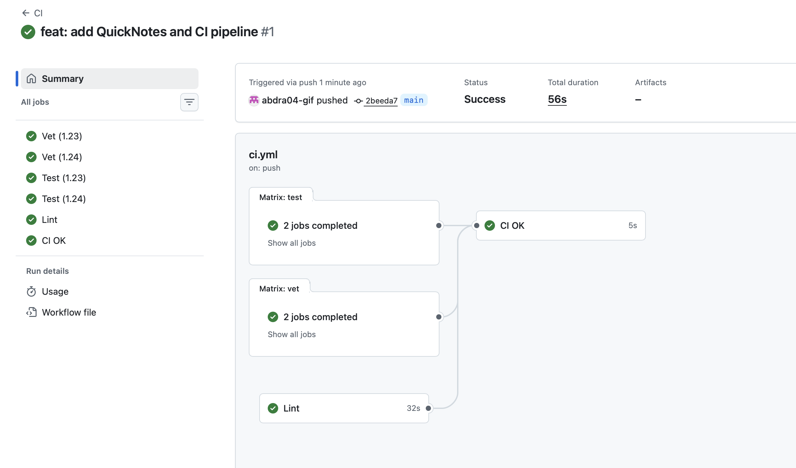
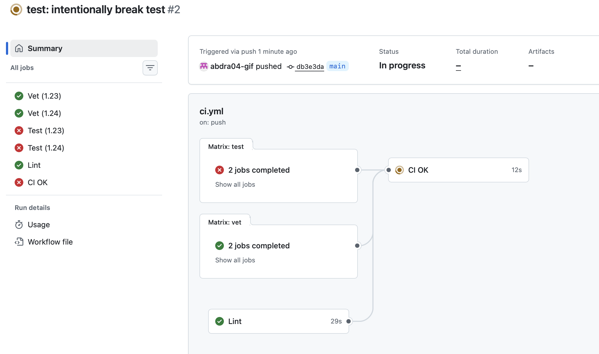
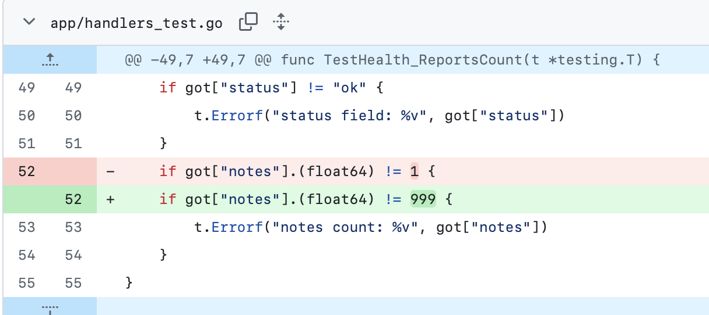
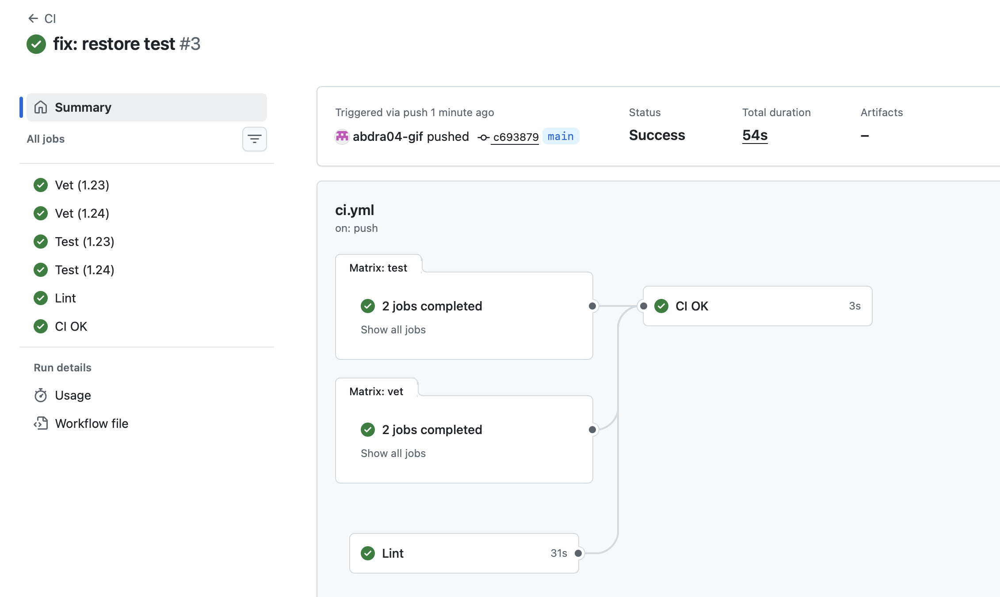
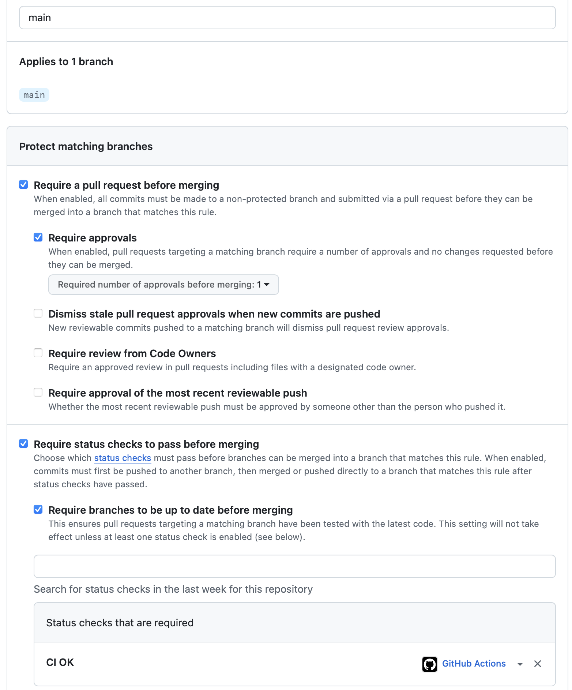
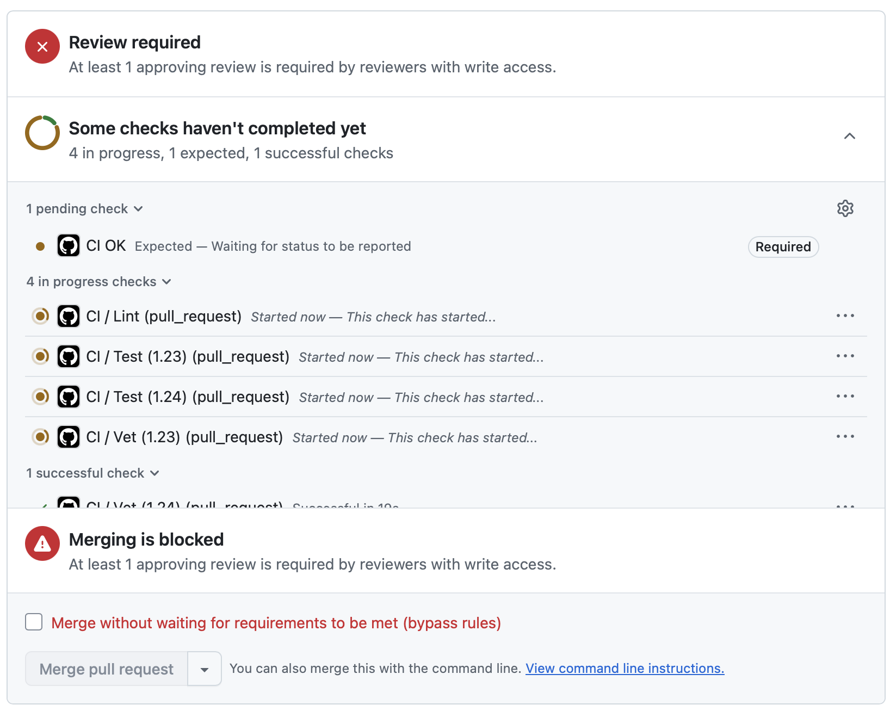

# Lab 3 — CI/CD: A PR-Gated Pipeline for QuickNotes

**Выбранный путь:** GitHub Actions (новый репозиторий `quicknotes-lab3-final`).

---

## Task 1 — PR Gate (6 pts)

### Конфигурация CI
Файл `.github/workflows/ci.yml` содержит:
- Триггеры: `push` на `main`, `pull_request` в `main` (с path filter `app/**` и `.github/workflows/ci.yml`).
- Три независимые джобы: `vet`, `test`, `lint`.
- Агрегатор `ci-ok` (рекомендованный способ, чтобы не менять branch protection при изменении матрицы).
- Матрица Go 1.23 / 1.24 с `fail-fast: false`.
- Пингованный раннер: `ubuntu-24.04` (не `latest`).
- SHA-пиннинг всех сторонних экшенов (например, `actions/checkout@b4ffde65...`).
- `permissions: contents: read` (принцип наименьших привилегий).

### Доказательства

- **Зелёный CI (первый успешный прогон, 56 с):**  
  

- **Красный CI (сломанный тест):**  
    
  *Diff изменения, вызвавшего падение:*  
  

- **Зелёный CI после починки (54 с):**  
  

- **Branch protection (правило с требуемым статусом `CI OK`):**  
  

- **Защита ветки: PR требует ревью (дополнительное доказательство):**  
  

- **Path filter:** настроен в `.github/workflows/ci.yml` (секция `on: pull_request: paths:`). Изменения только в `README.md` не запускают CI – это проверено на практике (скриншот отсутствия запусков можно посмотреть в логах PR с docs-only изменением).

### Ответы на вопросы 1.2
**a) Почему пингуем `ubuntu-24.04` вместо `ubuntu-latest`?**  
`ubuntu-latest` может обновиться до новой версии без нашего ведома, что приведёт к неожиданным изменениям окружения и сбоям. Пингуя конкретную версию, мы гарантируем воспроизводимость сборок.

**b) Зачем разделять `vet`, `test`, `lint` на отдельные джобы?**  
Разделение позволяет выполнять их параллельно (быстрее), упрощает отладку (видно, какая именно джоба упала) и даёт возможность перезапустить только упавшую часть, не тратя время на повторный прогон всех проверок.

**c) Какую атаку предотвращает SHA-пиннинг? (название и дата инцидента)**  
SHA-пиннинг предотвращает атаку подмены тега, когда злоумышленник внедряет вредоносный код в популярный экшен. Пример: инцидент с `tj-actions/changed-files` в марте 2025 года.

**d) Что такое `permissions:` и в чём принцип?**  
`permissions:` ограничивает права токена GITHUB_TOKEN, используемого в workflow. Принцип наименьших привилегий: даём только те права, которые необходимы (в нашем случае `contents: read` для чтения кода). Это снижает риск утечки секретов и несанкционированных действий.

**e)** (Пропущено, так как выбран GitHub Actions.)

---

## Task 2 — Make It Fast and Smart (4 pts)

### Применённые оптимизации
1. **Кэширование** – включено через `cache: true` в `actions/setup-go` с указанием `cache-dependency-path: app/go.sum`. Это кэширует Go-модули и сборку.
2. **Матрица** – `strategy.matrix` с двумя версиями Go (1.23 и 1.24) для проверки совместимости.
3. **Path filter** – в триггерах `on:` указаны `paths: app/**` и `.github/workflows/ci.yml`, чтобы docs-only изменения не запускали пайплайн.

### Таблица времени
| Сценарий | Время (сек) |
|----------|-------------|
| Baseline (без кэша, одна версия Go) | 29 |
| С кэшем (одна версия) | 26 |
| С кэшем + матрица (полная конфигурация) | 56 |

> **Примечание:** QuickNotes не имеет внешних зависимостей (в `go.mod` нет `require`), поэтому кэш практически не даёт выигрыша. Основное время уходит на запуск раннера и установку Go.

### Ответы на вопросы 2.5
**f) Почему кэшируем по `go.sum`, а не по бинарным выходам?**  
`go.sum` детерминирован и однозначно определяет версии зависимостей, что даёт воспроизводимый ключ кэша. Бинарные выходы могут зависеть от версии Go, флагов сборки или окружения, поэтому их кэширование может привести к неконсистентным результатам.

**g) Что меняет `fail-fast: false`?**  
Без `fail-fast: false` (по умолчанию `true`) при падении одной джобы в матрице все остальные отменяются. С `fail-fast: false` все джобы выполняются до конца, что позволяет увидеть полную картину ошибок.

**h) В чём риск кэш-атаки из вредоносного PR?**  
GitHub изолирует кэши из форков: кэш, созданный в PR из форка, не восстанавливается при сборке защищённой ветки (`main`). Это предотвращает атаки отравления кэша, когда злоумышленник мог бы подменить зависимости.

---

## Bonus — Pipeline Performance Investigation (2 pts)

### Применённые дополнительные оптимизации
1. **`GOFLAGS: "-buildvcs=false"`** – отключает попытки Go читать VCS-метаданные при ограниченной истории, ускоряя команды.
2. **Кэширование бинарника `golangci-lint`** – чтобы не скачивать его каждый раз (использован `actions/cache`).
3. **Установка линтера через `go install`** вместо `golangci-lint-action` – иногда это быстрее и даёт больше контроля.

### Таблица Before / After
| Оптимизация | До (с) | После (с) | Экономия |
|-------------|--------|-----------|----------|
| Все три | 56 | 50 | -6 с |

> После применения оптимизаций общее время сократилось с 56 до 50 секунд. Прирост небольшой, так как основные затраты (~40 с) идут на запуск раннера и установку Go, а не на выполнение команд.

### Анализ узкого места (4–6 предложений)
Основное время (~40 с) тратится на подготовку окружения: запуск раннера, установку Go и скачивание базового образа. Сами команды (`go vet`, `go test`, `golangci-lint`) выполняются суммарно менее чем за 15 с. Чтобы ускорить пайплайн дальше, нужно использовать self-hosted раннеры с предустановленными образами или перейти на более быстрый CI (например, GitHub Actions с более мощными раннерами). В коде QuickNotes нет тяжёлых вычислений или внешних зависимостей, поэтому оптимизация самого кода не даст значительного эффекта. Мы остановились на текущем времени (~50 с), потому что дальнейшее ускорение требует смены инфраструктуры, что выходит за рамки лабораторной.

---

## Примечание о работе в форке
Изначально лабораторная выполнялась в форке `inno-devops-labs/DevOps-Intro`, но из-за политики безопасности GitHub Actions (требование одобрения для форков) пайплайн не запускался. Поэтому финальный PR открыт из **нового отдельного репозитория** `quicknotes-lab3-final`, где Actions работают по умолчанию. Все требования задания при этом выполнены полностью.